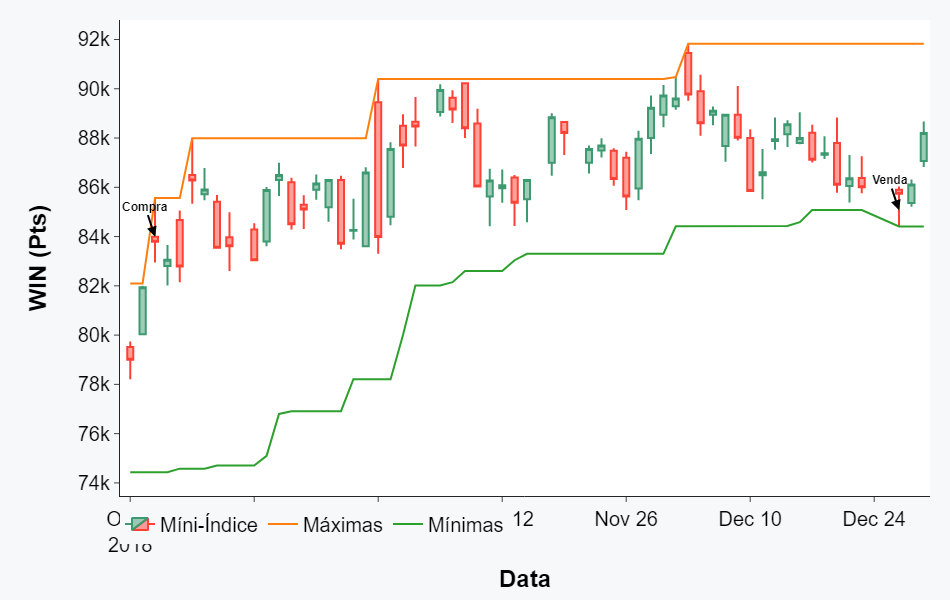
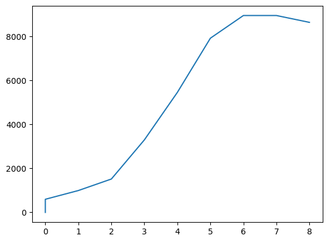
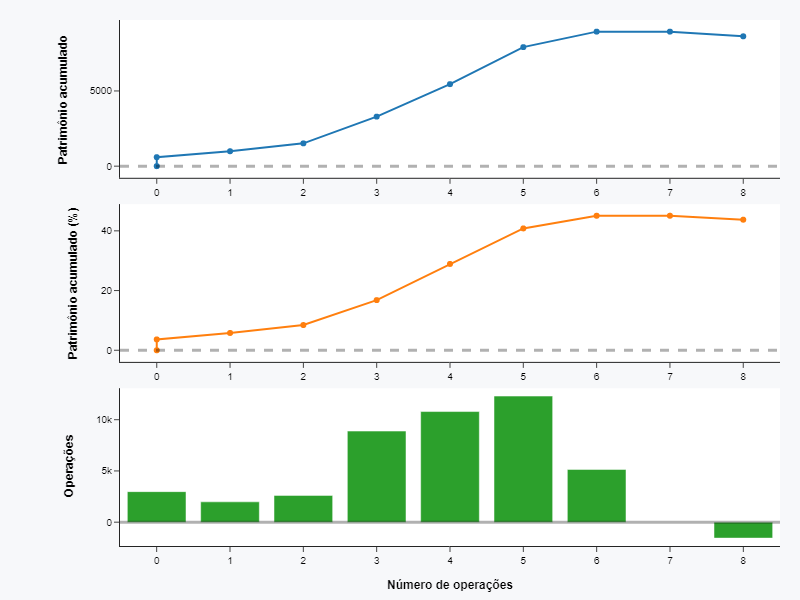

# Backtest de estratégia de rompimento de canal
Repositório contendo backtest de rompimento de canal desenvolvido por Van Tharp em seu livro "Trade your way to financial freedom".

Este backtest foi executado de forma manual, sem ajuda de bibliotecas externas, no mini-índice com 1 contrato.

## Explicação da estratégia 

Da forma como foi desenvolvida por Van Tharp, esta é uma estratégia executada no timeframe diário e somente na ponta compradora.

Quando o preço romper a máxima dos últimos 55 dias ele entra comprado. A saída da operação se dá quando romper para baixo a mínima dos últimos 21 dias.

Foram utilizados dados entre as datas de 01/01/2018 a 30/08/2022.

  

## Métricas do resultado

### Resultado líquido

Aqui temos o resultado em pontos do backtest no período. Para transformar em resultado financeiro (R$) precisamos, neste caso, dividir por 5 já que 5 pontos do mini-índice (1 tick) equivale a 1 real.

**Resultado = 43.165 pts** ou **R$ 8.633**

### Curva de patrimônio

Mostra a evolução do patrimônio a cada trade finalizado. Neste caso mostramos apenas o resultado financeiro.

  

### Taxa de acerto

Esta métrica informa o percentual de trades vencedores em relação ao total de operações.

**Taxa de acerto = 77.78%**

### Lucro médio e perda média

Como o próprio nome diz, nos diz quais as médias das operações vencedoras e das operações perdedoras respectivamente.

**Ganho médio = R$ 6.388,57**
**Perda média = R$ -1.555,00**

### Fator de lucro

Nos dá a relação entre o lucro bruto e a perda bruta, ou seja, a soma de todas as operações vencedoras pela soma de todas as operações perdedoras.

**Fator de lucro = 25.76**

## Conclusão

Por fim, temos um gráfico mostrando a evolução patrimonial junto com os resultados trade a trade.

  

Vimos que foi um resultado excelente, mas não podemos nos precipitar porque foram poucos trades o que constitui uma amostra muito pequena. Devemos fazer mais testes caso queira colocar esta estratégia em produção.
